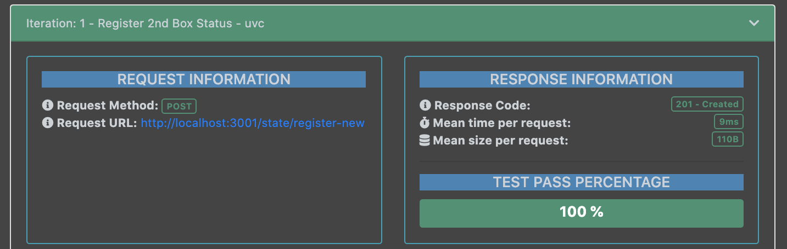

# BoxOfHope RESTful API

Welcome to the README for `API`.

## Summary

This `README.md` describes the usage and testing of the API created for use within the Box of Hope project.

The entire application is contained within the `API` folder.

## Usage

Run the api using the following commands:

```bash
npm install
MONGO_URL=[YOUR MONGO DB URL] npm start
```

### Resolving MongoDb Connection issues for Mac OS

You can ensure that you have a local `mongod` running by using `ps` piped into `grep`.

```bash
ps -alx | grep mongod
```

If this returns only one line, then `mongod` is not running. This can be resolved by carrying out the following commands:

```bash
mkdir $HOME/data
mongod --dbpath $HOME/data
```

### MongoDb Compass

MongoDB Compass is the recommended application for viewing your database.

## Documentation

Go to [http://<app_host>:<app_port>/api-docs](http://localhost:3000/api-docs) after starting the server to view Swagger JS documentation detailing the available HTTP requests.

## Testing

API testing has been carried out using Postman tests and can be found in `BoxOfHopeAPI.postman_collection.json`.

Testing covers returned status codes, basic request functionality, response times and request flow.

API test reports can be generated using Newman's HTMLExtra Reporter. First, install Newman and the reporter:

```bash
npm install -S newman newman-reporter-htmlextra
```

Run the following command to run tests and generate reports:

```bash
npm run report
```

The first time you run this command, it creates a new folder, newman, at the root of the project, and adds a timestamped html file to the folder. Open the file in your browser to review the test report.

The following image shows an example of the API test docs:


For each test, the following information is given in the report: request information, response information, request headers, request body, response headers, response body, and test outcome information.



## CI

The `API` workflow within GitHub actions handles the continuous integration an testing of the API. This can be found within `api_ci.yml`.
